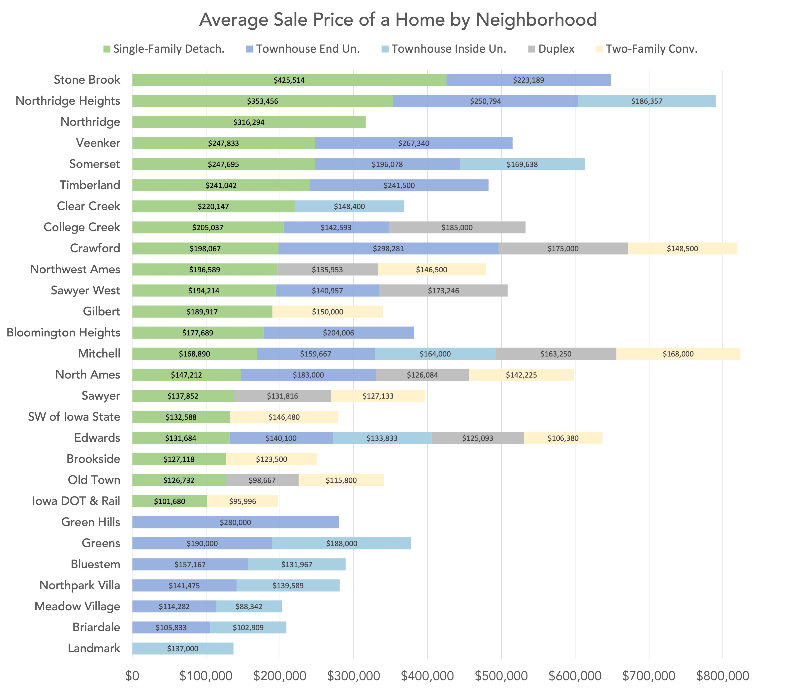
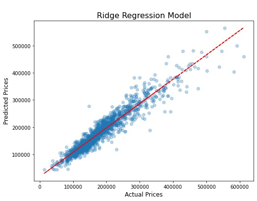

# Predicting Property Values in Ames, Iowa

## Background
The dataset provided for this project was a collection of 2,051 observations from the Ames Assessor’s Office used in computing property values for individual residential properties in the city of Ames, IA from 2006 to 2010. This data file was thorough and comprehensive. It contained 80 different columns of nominal, ordinal, discrete and continuous variables.

## Problem Statement
Help the city of Ames, IA create the most predictive model possible given categorical and numerical data about various properties and their surrounding neighborhoods, to inform future data collection and pricing assessments.

## Data Dictionary

|Feature|Type|Description|
|---|---|---|
|**Neighborhood**|*Ordinal*|Rank-ordered (1-28) by least-most expensive neighborhood| 
|**Loc Score**|*Discrete*|Calculation of Overall Qual, Overall Cond, Exter Qual, Exter Cond, & Functional|
|**Overall Qual**|*Ordinal*|(1-10) Rates the overal material and finish of the house|
|**Year Built**|*Discrete*|Original construction date|
|**Full Bath**|*Discrete*|Full baths|
|**Bedroom AbvGr**|*Discrete*|Bedrooms (not including basement)|
|**Fireplaces**|*Discrete*|Number of fireplaces|
|**Bsmt Qual**|*Ordinal*|Height of the basement on a 5-point scale|
|**BsmtFin Type 1**|*Ordinal*|Rating of basement finished area on a 6-point scale|
|**Garage Cars**|*Discrete*|Size of garage by number of cars|
|**Garage Cond**|*Ordinal*|Garage condition on a 5-point scale|
|**Garage Type**|*Ordinal*|Attached/detached/car port rank-ordered (1-6) by least-most value|
|**Kitchen Qual**|*Ordinal*|Kitchen quality on a 5-point scale|
|**Heating QC**|*Ordinal*|Heating quality and condition on a 5-point scale|
|**Total SF**|*Discrete*|Calculation of Basement, 1st Floor, and 2nd Floor square footage|
|**residential**|*Ordinal*|Rank ordered (1-4) by price per square foot |
|**commercial**|*Boolean*|Commercial zone|
|**industrial**|*Boolean*|Industrial zone|
|**near_amenity**|*Boolean*|Near positive off-site amenity|
|**near_rail**|*Boolean*|Near railroad|
|**near_road**|*Boolean*|Near artery or feeder road|
|**is_1Fam**|*Boolean*|Single family detached home|
|**is_Duplex**|*Boolean*|Duplex|
|**is_2fmCon**|*Boolean*|Two-family Conversion|
|**is_Twnhs**|*Boolean*|Townhouse|
|**is_TwnhsE**|*Boolean*|Townhouse End Unit|
|**sold_2006**|*Boolean*|Sold in 2006|
|**sold_2007**|*Boolean*|Sold in 2007|
|**sold_2008**|*Boolean*|Sold in 2008|
|**sold_2009**|*Boolean*|Sold in 2009|
|**sold_2010**|*Boolean*|Sold in 2010|

---

# Summary
I started this project with a significant amount of Exploratory Data Analysis, particularly with an emphasis on feature selection. The variables that stood out to me first were Neighborhood and Building Type, as there was a clear stratification among sale prices. Homes in wealthier neighborhoods like Stone Brook, Northridge Heights, and Northridge sold for much more than their less-expensive counterparts in Briardale or Landmark. Likewise, single-family detached homes were far and away the highest-selling property within each neighborhood. However, I couldn’t rule out that other variables might be the underlying cause here. Zoning was a fairly illustrative predictor, as Commercial properties sold for way cheaper than any other category. Proximity to nearby features was also a factor. Homes near major roads or railroads saw a decrease in value, while those near a “positive off-site feature” increased in value.
   
Overall, this dataset contained a wealth of qualitive and quantitative features that took time to dig into. Before I started the modeling process, it was important to transform and standardize many of these variables, as well as remove duplicate or collinear features. For example, there were seven different columns to describe garages: Garage Quality, Garage Condition, Garage Finish, Garage Year Built, Garage Area, Garage Cars, and Garage Type. Correlation matrices and heatmaps helped reveal a lot of the overlaps here, as did good old-fashioned statistical analysis.
  
Once I felt like I had a representative sample of features, the data wrangling began. Most importantly, I had to encode the categorical features into numerical equivalents to prepare the dataset for machine learning. I rank-ordered the Neighborhood category (1-28), Garage Type (1-6), and Residential Density variables (1-4) from least to most value. Then, I was able to map most quality and condition terms to a 5-point scale of Excellent, Good, Average/Typical, Fair, and Poor. But ultimately, some categorical information had to be one-hot encoded, meaning every value was extracted to its own True/False column. This resulted in binary 0/1 features like  Zone_Commerical, Zone_Industrial, Near_RoadRail, and Near_Amenity. It also made sense to combine several of the Square Footage columns (Basement, 1st Floor, 2nd Floor) into one “Total Square Footage” feature. Finally, taking the natural log of Sale Price created a more densely distributed and significantly more linear target variable.
  
As for the modelling itself, I tried Linear Regression, Ridge Regression, and Lasso Regression after dividing the data into train and test sets. These all provided nearly identical metrics, with R2 and cross validation scores around 90$ accuracy. Similarly, the average error for each model was about $23,600. This was a significant improvement when compared to the baseline model average error of $78,000. After several rounds of testing, the Ridge Regression model ultimately performed slightly better on unknown data, meaning it had less variance and was more generalizable as an algorithm.

## Conclusions and Recommendations
At the end of the day, the goal of this project was not to provide a consumer-facing analysis about how homeowners could add value to their property or how real estate companies should invest in the area. The focus was on helping the city of Ames, IA develop the most accurate model possible and improving the quality of the data they’ve gathered so far. As such, I identified some missing information that would be relevant to a property assessment. This data could benefit from more detail on kitchen finishes (i.e. countertops, backsplashes) and appliances. Does the property have a built-in dishwasher, oven/range, or a fridge? These factors would definitely impact the sale price of a house.
  
Also, the model could use more information on storage square footage, particularly closets or attic space. This is a must-have for growing families, as is information about local school districts. It stands to reason that the neighborhood boundaries might not line up perfectly with school districts, and the quality of local schools is a significant factor in home purchases. Finally, it might be helpful to clarify the “positive off-site features” referenced in the data dictionary. Which specific locales (parks, recreation centers, historical sites, etc.), would positively impact a property value? These are just a few of many ways the city of Ames, IA could improve on their already detailed and informative property assessment criteria.